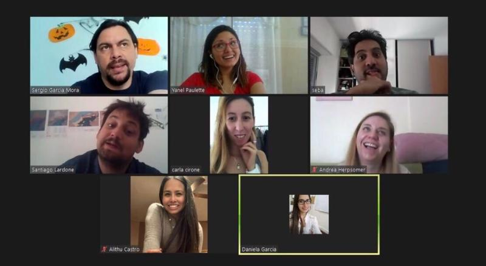
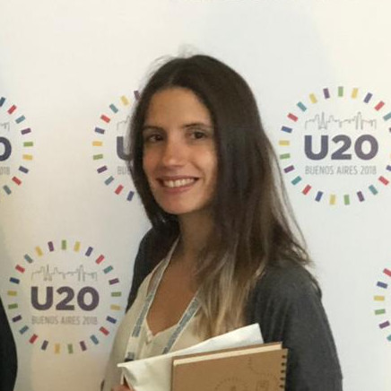

class: inverse, top, center
background-image: url(Archivos/kiwi-fondo.png)
background-size: cover

```{r setup, include=FALSE}
knitr::opts_chunk$set(fig.retina = 3, warning = FALSE, message = FALSE)
```

---

```{r metathis, echo=FALSE}
library(metathis)
meta() %>%
  meta_name("github-repo" = "r4hr/club_de_r") %>% 
  meta_social(
    title = "Sesión abierta Dic. 2020 - Introducción a dplyr",
    description = paste(
      "Una introducción a cómo manipular y transformar datos con dplyr",
      "por el Club de R para RRHH"),
    url = "https://clubder-rmarkdown.netlify.app/",
    image = "https://github.com/r4hr/r4hr_introduccion_dplyr/blob/main/Archivos/kiwi-fondo.png",
    image_alt = paste(
      "Inttroducción a dplyr", 
      "Desarrollada por el Club de R para RRHH"
    ),
    og_type = "website",
    og_author = "Sergio Garcia Mora",
    twitter_card_type = "summary_large_image",
    twitter_creator = "@sergiogarciamor",
    twitter_site = "@club_rrhh"
  )
```

```{r xaringanExtra-share-again, echo=FALSE}
xaringanExtra::use_share_again()
```


???

Image credit: [Designed by Freepik]("http://www.freepik.com")

---
# Quiénes somos

El [Club de R para RRHH](https://r4hr.club) es una comunidad de aprendizaje de programación en R destinada para las personas que trabajan en Recursos Humanos de habla hispana.

Nuestro objetivo es acercar el mundo de ciencias de datos a nuestra profesión, adaptando el contenido a nuestros skills y conocimientos, y también siempre que podemos, usando datos relacionados con la gestión de personas y en castellano, para hacer más accesible e inclusivo el aprendizaje.

Este es un proyecto que reúne a gente de Argentina, Perú, Chile, Paraguay, Uruguay, Panamá, USA, Francia, y cada vez más y más profesionales de distintas latitudes se unen y contribuyen al proyecto.

Para más información sobre el Club de R leé [este post](https://r4hr.club/2020/09/23/el-club-de-r-para-rrhh/), o escribinos a [info@r4hr.club](mailto:info@r4hr.club).

---
# Quiénes somos
## La encuesta KIWI `r emo::ji("kiwi")` de Sueldos de RRHH para LATAM

Uno de los problemas en el aprendizaje de People Analytics es la falta de datasets para practicar, así que una decisión que tomamos fue el de generar nuestro propio dataset y de abrirlo para toda la comunidad.

Para hacer esta encuesta nos "inspiramos" en [SysArmy](https://sysarmy.com/blog/), una comunidad para las personas que trabajan en tecnología que además de organizar uno de los eventos más importantes de tecnología de Argentina, **Nerdearla**, y que también organizan una encuesta salarial dos veces por año.

Estas son las motivaciones detrás de esta encuesta. Tener nuestro propio dataset, compartir los resultados y los datos, para que todos los entusiastas de RRHH y de los datos cuenten con una fuente de datos para practicar.

> Si querés conocer la historia detrás del nombre de la encuesta, la podés [conocer aquí](https://r4hr.club/why-kiwi/).

---
background-color: "#5D6D7E" 
# Quiénes somos
## Organizadores
.pull-left[
`r emo::ji("male_detective")` [Adrián Quiroga](https://www.linkedin.com/in/adrian-quiroga-ab57424b/) 

`r emo::ji("woman_technologist")` [Alithu Castro](https://www.linkedin.com/in/alithucastro/)

`r emo::ji("woman_student")` [Andrea Herpsomer](https://www.linkedin.com/in/andreaherpsomer/)

`r emo::ji("woman_artist")` [Carla Cirone](https://www.linkedin.com/in/carla-cirone-0566b095/)

`r emo::ji("woman_technologist")` [Daniela García](https://www.linkedin.com/in/claudia-daniela-garcia-138b1a14b/)

`r emo::ji("woman_astronaut")` [Lucía Huilén Gómez](https://www.linkedin.com/in/luc%C3%ADa-huil%C3%A9n-g%C3%B3mez-93565276/)

`r emo::ji("man_singer")` [Santiago Lardone Quinodoz](https://www.linkedin.com/in/santiago-lardone-quinodoz-978588167/)

`r emo::ji("snake")` [Sebastián Lombraña](https://www.linkedin.com/in/santiago-lardone-quinodoz-978588167/)

`r emo::ji("metal")` [Sergio García Mora](https://www.linkedin.com/in/sergiogarciamora/)

`r emo::ji("woman_teacher")` [Yanel Paulette](https://www.linkedin.com/in/yanelpaulette/)
]

.pull-right[]
---
# Invitados

Habitualmente las presentaciones del Club las hacemos nosotros. Pero una vez al mes, invitamos a un Data Scientist que nos hable sobre un tema de su especialidad. Así hemos tenido a gente como: 


--

.pull-left[

 [Pablo Tiscornia](https://www.linkedin.com/in/ptiscornia/): Paquete EPH.

 [Pablo Casas](https://www.linkedin.com/in/pcasas/): Análisis Exploratorio con `funModeling`.

 [Ana Laura Diedrichs](https://www.linkedin.com/in/ana-laura-diedrichs-47038415/): Introducción a control de versiones con Git.

 [Hernán Escudero](https://www.linkedin.com/in/hernanescudero/): Aplicaciones interactivas con `Shiny`.

 [Ángeles Scetta](https://www.linkedin.com/in/mar%C3%ADa-de-los-%C3%A1ngeles-scetta-b7b82a80/): Análisis de datos geoespaciales en R.  

 [Paola Corrales](https://paocorrales.github.io/): Publicar RMarkdown en la Web.  
]   

--

.pull-right[

### Y nuestros créditos "locales" `r emo::ji("applause")`

 [Alithu Castro](https://www.linkedin.com/in/alithucastro/): Estadística y notebooks de R.

 [Luis Grau](https://www.linkedin.com/in/luis-grau-r-212b3a9/): Formato de tablas con `kable`.

]

---
# Invitados
## Suscripción al Club de R para RRHH

Todos los sábados de 10:00 a 11:30 hs. nos reunimos para revisar paquetes, tipos de análisis, proyectos, etc.. Mayormente utilizamos datos de RRHH (salvo los invitados) y en castellano para que sólo nos preocupemos por entender R, y no tener que intentar comprender datos extraños.

--

La suscripción al Club tiene costo, que dedicamos principalmente a pagarlo los honorarios a los invitados, y a las licencias de algunas plataformas, pero desde **noviembre, la sesión del primer sábado de cada mes será abierta y gratuita** `r emo::ji("party")`.

.right[]

---

## Antes de empezar

Algunas cosas que tienen que saber:


--

* No hace falta que tengan la cámara encendida. `r emo::ji("detective")`

--

* Esta sesión queda grabada y la subimos a Youtube. `r emo::ji("movie_camera")`

--

* Súmense al grupo de [Slack](https://join.slack.com/t/r4hr/shared_invite/zt-geqfwra8-iZv3G5admNbyuej2gyFQDg) ya que todas las consultas las hacemos por ahí. `r emo::ji("fist_right")``r emo::ji("fist_left")`

--

* Pueden interrumpir las veces que quieran. `r emo::ji("raising_hand")`

---
class: inverse center middle
# Empecemos!


---
# ¿Qué son los paquetes en R?

R es un lenguaje abierto de programación, que se hizo muy popular para analizar datos pero que tienen infinidad de aplicaciones y usos que van más allá del análisis estadístico.

Los *paquetes* son una suerte de "extensiones" que amplían la capacidad de R base. Pablo Tiscornia hizo una analogía muy buena para explicar qué son:

--

.pull-left[

]

--
.pull-right[

]

---
# Tidy Data

Cuando hacemos algún tutorial, los datos están perfectos, limpios, y prolijos. Y cuando querés aplicar el mismo código a tus propios datos, resulta que no funciona, o tenés que hacer mucho procesamiento de datos para terminar replicando un ejemplo de un tutorial.

--

Por estas razones, la limpieza de datos, suele representar entre el 60 al 80% de cualquier proyecto de Analytics, hasta lograr tener **datos ordenados** (tidy data). Entre algunos principios de *tidy data* podemos mencionar dos:

--

1. Cada variable forma una columna.
2. Cada observación forma una fila.
3. Cada tipo de unidad observacional forma una tabla.


---
class: inverse, center, bottom

# `r fontawesome::fa(name = "github-alt", fill = "white")`
[Repo](https://github.com/r4hr/r4hr_introduccion_dplyr)


Presentación realizada con el paquete [Xaringan](https://github.com/yihui/xaringan) desarrollado por Yihui Xie.

Gracias a [Patricia Loto](https://twitter.com/patriloto) por compartir el [tutorial](https://twitter.com/patriloto/status/1260822644590608391?s=20)

<a rel="license" href="http://creativecommons.org/licenses/by-nc/4.0/"></a><br /><span xmlns:dct="http://purl.org/dc/terms/" property="dct:title">Introducción a dplyr</span> por <a xmlns:cc="http://creativecommons.org/ns#" href="https://clubder-dplyr.netlify.app/#1" property="cc:attributionName" rel="cc:attributionURL">Club de R para RRHH</a> se distribuye bajo una <a rel="license" href="http://creativecommons.org/licenses/by-nc/4.0/">Licencia Creative Commons Atribución-NoComercial 4.0 Internacional</a>.<br />Basada en una obra en <a xmlns:dct="http://purl.org/dc/terms/" href="https://github.com/r4hr/r4hr_introduccion_dplyr" rel="dct:source">https://github.com/r4hr/r4hr_introduccion_dplyr</a>.<br />Permisos más allá del alcance de esta licencia pueden estar disponibles en <a xmlns:cc="http://creativecommons.org/ns#" href="https://r4hr.club" rel="cc:morePermissions">https://r4hr.club</a>.
