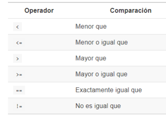

class: inverse, top, center
background-image: url(Archivos/kiwi-fondo.png)
background-size: cover

```{r setup, include=FALSE}
knitr::opts_chunk$set(fig.retina = 3, warning = FALSE, message = FALSE)
```

---

```{r metathis, echo=FALSE}
library(metathis)
meta() %>%
  meta_name("github-repo" = "r4hr/club_de_r") %>% 
  meta_social(
    title = "Sesión abierta Dic. 2020 - Introducción a dplyr",
    description = paste(
      "Una introducción a cómo manipular y transformar datos con dplyr",
      "por el Club de R para RRHH"),
    url = "https://clubder-rmarkdown.netlify.app/",
    image = "https://github.com/r4hr/r4hr_introduccion_dplyr/blob/main/Archivos/kiwi-fondo.png",
    image_alt = paste(
      "Inttroducción a dplyr", 
      "Desarrollada por el Club de R para RRHH"
    ),
    og_type = "website",
    og_author = "Sergio Garcia Mora",
    twitter_card_type = "summary_large_image",
    twitter_creator = "@sergiogarciamor",
    twitter_site = "@club_rrhh"
  )
```

```{r xaringanExtra-share-again, echo=FALSE}
xaringanExtra::use_share_again()
```


???

Image credit: [Designed by Freepik]("http://www.freepik.com")

---
# Quiénes somos

El [Club de R para RRHH](https://r4hr.club) es una comunidad de aprendizaje de programación en R destinada para las personas que trabajan en Recursos Humanos de habla hispana.

Nuestro objetivo es acercar el mundo de ciencias de datos a nuestra profesión, adaptando el contenido a nuestros skills y conocimientos, y también siempre que podemos, usando datos relacionados con la gestión de personas y en castellano, para hacer más accesible e inclusivo el aprendizaje.

Este es un proyecto que reúne a gente de Argentina, Perú, Chile, Paraguay, Uruguay, Panamá, USA, Francia, y cada vez más y más profesionales de distintas latitudes se unen y contribuyen al proyecto.

Para más información sobre el Club de R leé [este post](https://r4hr.club/2020/09/23/el-club-de-r-para-rrhh/), o escribinos a [info@r4hr.club](mailto:info@r4hr.club).

---
# Quiénes somos
## La encuesta KIWI `r emo::ji("kiwi")` de Sueldos de RRHH para LATAM

Uno de los problemas en el aprendizaje de People Analytics es la falta de datasets para practicar, así que una decisión que tomamos fue el de generar nuestro propio dataset y de abrirlo para toda la comunidad.

Para hacer esta encuesta nos "inspiramos" en [SysArmy](https://sysarmy.com/blog/), una comunidad para las personas que trabajan en tecnología que además de organizar uno de los eventos más importantes de tecnología de Argentina, **Nerdearla**, y que también organizan una encuesta salarial dos veces por año.

Estas son las motivaciones detrás de esta encuesta. Tener nuestro propio dataset, compartir los resultados y los datos, para que todos los entusiastas de RRHH y de los datos cuenten con una fuente de datos para practicar.

> Si querés conocer la historia detrás del nombre de la encuesta, la podés [conocer aquí](https://r4hr.club/why-kiwi/).

---
background-color: "#5D6D7E" 
# Quiénes somos
## Organizadores
.pull-left[
`r emo::ji("male_detective")` [Adrián Quiroga](https://www.linkedin.com/in/adrian-quiroga-ab57424b/) 

`r emo::ji("woman_technologist")` [Alithu Castro](https://www.linkedin.com/in/alithucastro/)

`r emo::ji("woman_student")` [Andrea Herpsomer](https://www.linkedin.com/in/andreaherpsomer/)

`r emo::ji("woman_artist")` [Carla Cirone](https://www.linkedin.com/in/carla-cirone-0566b095/)

`r emo::ji("woman_technologist")` [Daniela García](https://www.linkedin.com/in/claudia-daniela-garcia-138b1a14b/)

`r emo::ji("woman_astronaut")` [Lucía Huilén Gómez](https://www.linkedin.com/in/luc%C3%ADa-huil%C3%A9n-g%C3%B3mez-93565276/)

`r emo::ji("man_singer")` [Santiago Lardone Quinodoz](https://www.linkedin.com/in/santiago-lardone-quinodoz-978588167/)

`r emo::ji("snake")` [Sebastián Lombraña](https://www.linkedin.com/in/santiago-lardone-quinodoz-978588167/)

`r emo::ji("metal")` [Sergio García Mora](https://www.linkedin.com/in/sergiogarciamora/)

`r emo::ji("woman_teacher")` [Yanel Paulette](https://www.linkedin.com/in/yanelpaulette/)
]

.pull-right[]
---
# Invitados

Habitualmente las presentaciones del Club las hacemos nosotros. Pero una vez al mes, invitamos a un Data Scientist que nos hable sobre un tema de su especialidad. Así hemos tenido a gente como: 


--

.pull-left[

 [Pablo Tiscornia](https://www.linkedin.com/in/ptiscornia/): Paquete EPH.

 [Pablo Casas](https://www.linkedin.com/in/pcasas/): Análisis Exploratorio con `funModeling`.

 [Ana Laura Diedrichs](https://www.linkedin.com/in/ana-laura-diedrichs-47038415/): Introducción a control de versiones con Git.

 [Hernán Escudero](https://www.linkedin.com/in/hernanescudero/): Aplicaciones interactivas con `Shiny`.

 [Ángeles Scetta](https://www.linkedin.com/in/mar%C3%ADa-de-los-%C3%A1ngeles-scetta-b7b82a80/): Análisis de datos geoespaciales en R.  

 [Paola Corrales](https://paocorrales.github.io/): Publicar RMarkdown en la Web.  
]   

--

.pull-right[

### Y nuestros créditos "locales" `r emo::ji("applause")`

 [Alithu Castro](https://www.linkedin.com/in/alithucastro/): Estadística y notebooks de R.

 [Luis Grau](https://www.linkedin.com/in/luis-grau-r-212b3a9/): Formato de tablas con `kable`.

]

---
# Invitados
## Suscripción al Club de R para RRHH

Todos los sábados de 10:00 a 11:30 hs. nos reunimos para revisar paquetes, tipos de análisis, proyectos, etc.. Mayormente utilizamos datos de RRHH (salvo los invitados) y en castellano para que sólo nos preocupemos por entender R, y no tener que intentar comprender datos extraños.

--

La suscripción al Club tiene costo, que dedicamos principalmente a pagarlo los honorarios a los invitados, y a las licencias de algunas plataformas, pero desde **noviembre, la sesión del primer sábado de cada mes será abierta y gratuita** `r emo::ji("party")`.

.right[]

---

## Antes de empezar

Algunas cosas que tienen que saber:


--

* No hace falta que tengan la cámara encendida. `r emo::ji("detective")`

--

* Esta sesión queda grabada y la subimos a Youtube. `r emo::ji("movie_camera")`

--

* Súmense al grupo de [Slack](https://join.slack.com/t/r4hr/shared_invite/zt-geqfwra8-iZv3G5admNbyuej2gyFQDg) ya que todas las consultas las hacemos por ahí. `r emo::ji("fist_right")``r emo::ji("fist_left")`

--

* Pueden interrumpir las veces que quieran. `r emo::ji("raising_hand")`

---
class: inverse center middle
# Empecemos!


---
# El lenguaje R
## Proyectos

Trabajar con proyectos en RStudio hace que todo el trabajo sea más sencillo. Los proyectos crean una carpeta en nuestra PC en donde se almacenarán los archivos, tablas, scripts, y hace que todo sea más organizado.

--

Para crear un proyecto tenés podés entrar en:
* *File*
  * *New project*

Y luego poner el nombre de la carpeta.

.pull-left[]


.pull-rigt[]

---
# ¿Qué son los paquetes en R?

R es un lenguaje abierto de programación, que se hizo muy popular para analizar datos pero que tienen infinidad de aplicaciones y usos que van más allá del análisis estadístico.

Los *paquetes* son una suerte de "extensiones" que amplían la capacidad de R base. Pablo Tiscornia hizo una analogía muy buena para explicar qué son:

--

.pull-left[

]

--
.pull-right[

]

---
# Instalando y cargando dplyr

Al igual que la gran mayoría de los paquetes de R, podemos instalar el paquete directamente desde el script:

```{r eval=FALSE}
# Instalando el paquete individual
install.packages("dplyr")

# Instalando el conjunto de paquetes de tidyverse
install.packages("tidyverse")

```

--

Antes de empezar a usar las funciones de dplyr, tenemos que cargarlo con la función `library()`:
```{r}
library(dplyr)
```


---
# Tidy Data

Cuando hacemos algún tutorial, los datos están perfectos, limpios, y prolijos. Y cuando querés aplicar el mismo código a tus propios datos, resulta que no funciona, o tenés que hacer mucho procesamiento de datos para terminar replicando un ejemplo de un tutorial.

--

Por estas razones, la limpieza de datos, suele representar entre el 60 al 80% de cualquier proyecto de Analytics, hasta lograr tener **datos ordenados** (tidy data). Entre algunos principios de *tidy data* podemos mencionar dos:

--

1. Cada variable forma una columna.
2. Cada observación forma una fila.
3. Cada tipo de unidad observacional forma una tabla.

---
# dplyr


El paquete **dplyr** es uno de los paquetes embebidos dentro del paquete tidyverse: un conjunto de paquetes destinados a la limpieza y manipulación de datos y que se convirtió en un estándar en la práctica de la limpieza y manipulación de datos en R. `dplyr` fue desarrollado por Hadley Wickham, Romain François, Lionel Henry y Kirill Müller.

Una de las razones por las que se hizo tan popular es por su sintaxis simple, con nombres de funciones que usan palabras muy coloquiales, imitando la forma en la que hablamos.

Usualmente se dice que usamos `dplyr` para hacer *data wrangling*. Así que empecemos a aprender a domar nuestros datos.

<br><br>


.center[

]

---
# A domar datos!


---
class: inverse
# Los cheatsheets
## (machete, cola, trencito, copiatín, plage, batería, torpedo, chuleta, chanchullo, etc.)

Los [*cheatsheet*](https://rstudio.com/resources/cheatsheets/) son documentos con resúmenes de las principales funciones de los paquetes más utilizados.

La comunidad de R de hispanoamérica ha traducido unos cuantos, gracias a quienes podemos contar hoy con un cheatsheet en [castellano](https://github.com/rstudio/cheatsheets/raw/master/translations/spanish/data-wrangling-cheatsheet_Spanish.pdf).

.right[

]

---
# Los datasets

.pull-left[


]

.pull-right[
```{r}
library(dplyr) # Manipulación y limpieza de datos
library(readr) # Lectura y carga de archivos

# Cargamos encuesta de sueldos
encuesta <- read_delim("https://raw.githubusercontent.com/r4hr/r4hr_introduccion_dplyr/main/Datos/encuesta_sueldos.csv", delim = ",")

# Cargamos otro archivo con kpis de ausentismo y de horas extras
kpis <- read_delim("https://raw.githubusercontent.com/r4hr/r4hr_introduccion_dplyr/main/Datos/kpi_aus_he.csv", delim = ";")
```
]
---
# Los "verbos" en dplyr

Una de las razones por las cuales tidyverse se hizo tan popular es que la lógica de las funciones imita el razonamiento que haríamos verbalmente.

--

Por ejemplo, ¿cómo harían para calcular el sueldo promedio por puesto?

--

```{r}
encuesta %>% 
  select(puesto, sueldo_bruto) %>% # Selecciona las columnas
  group_by(puesto) %>%     # Agrupa por la variable puesto
  summarise(sueldo_promedio = mean(sueldo_bruto)) %>% # Crea una variable con el sueldo promedio
  arrange(-sueldo_promedio) # Ordena descendentemente los resultados por la variable que pasemos.
```

---
# dplyr
## El "pipe"

¿Vieron este símbolo `%>%` en la slide anterior? En la jerga lo conocemos como *"pipe"* (atajo de teclado Ctrl + Mayús + M). Lo que nos permite este *"tubo"* es ordenar el código en secuencias, haciéndolo más comprensible a la lectura.

Una de las ventajas del *pipe* es que no necesitamos invocar al dataframe en cada función que encadenamos en el pipe.

.center[

]

---
# dplyr
## Secuencias

Por ejemplo, si quiero ver los sueldos brutos por puesto de las personas que no tienen gente a cargo ordenados por el puesto. Los pasos son:

1. Elegir las variables puesto, sueldo_bruto, personas_a_cargo.
2. Filtrar de la variable personas_a_cargo los casos que no tienen gente a cargo.
3. Ordenar los resultados por puesto.

> Acá estoy usando la función `head()` para que quede prolijo en la presentación. Ustedes no la usen y recuerden sacar el último paréntesis

```{r}
head(arrange(filter(select(encuesta, puesto, sueldo_bruto, personas_a_cargo), personas_a_cargo > 0), puesto))
```

---

## dplyr

Esto mismo usando el pipe de dplyr lo hacemos así:
```{r}
encuesta %>%
  select(puesto, sueldo_bruto, personas_a_cargo) %>%
  filter(personas_a_cargo>0) %>%
  arrange(puesto) %>% 
  head()
```


---
# ¿Cuál es más fácil de entender?
<br>

### Código sin el pipe

```{r eval=FALSE}
arrange(filter(select(encuesta, puesto, sueldo_bruto, personas_a_cargo), personas_a_cargo > 0), puesto)

```


### Código con el pipe

```{r eval=FALSE}
encuesta %>%
  select(puesto, sueldo_bruto, personas_a_cargo) %>%
  filter(personas_a_cargo>0) %>%
  arrange(puesto)
```
---

class: inverse, middle
background-image: url("Archivos/dplyr.png")
background-size: cover

---
# Las funciones de dplyr
## select()

La función `select()` sirve para elegir las columnas (variables) con las que queremos trabajar. También nos permite traer las columnas en el orden que las necesitemos.

```{r}
encuesta %>% 
  select(satisfaccion, sueldo_bruto) %>% 
  head()
```

---
## select()

select() tiene algunas variantes interesantes (y en general aplican para casi todas las funciones de dplyr).

Supongamos que quiera seleccionar todas las columnas numéricas nada más:


```{r}
encuesta %>%
  select_if(is.numeric) %>% 
  head()
```

---


## filter()

.pull-left[
`filter()` nos permite obtener las filas (observaciones) que cumplen con las condiciones que necesitamos.

Empleados que tienen hijos

```{r}
encuesta %>%
  select(personas_a_cargo, sueldo_bruto) %>% 
  filter(personas_a_cargo  > 0) %>% 
  head()
```

]

.pull-right[
Estas son los operadores lógicos que nos van a ayudar con la función filter.


]

---

## filter()

filter() nos permite obtener las filas (observaciones) que cumplen con las condiciones que necesitamos.

Listado de respuestas de Universidad Privada y de empresas con más de 700 empleados.

```{r}
# Filtramos los empleados que son de Universidad Privada y de empresas con más de 700 empleados.
encuesta %>%
  filter(universidad == "Universidad Privada" &  empleados > 700)
```

---
## filter()

filter() nos permite obtener las filas (observaciones) que cumplen con las condiciones que necesitamos.

Empleados de dos rubros diferentes
```{r}
encuesta %>%
  filter(rubro == "Servicios de salud"| rubro == "Tecnologías de Información, Sistemas, y afines")
```
 
---
## filter()
Una alternativa es usar un vector de selección
```{r eval = FALSE}
encuesta %>%
  filter(rubro %in% c("Servicios de salud", "Tecnologías de Información, Sistemas, y afines")) %>% 
  head()
```

---

## filter()

filter() nos permite obtener las filas (observaciones) que cumplen con las condiciones que necesitamos.

Podemos filtrar un rango de sueldos de la siguiente manera combinando la función `between()`:

```{r}
encuesta %>% 
  filter(between(sueldo_bruto,      # Variable a filtrar 
                 50000,             # Valor mínimo
                 150000)) %>%       # Valor máximo
  head()
```


---
## arrange()

`arrange()` ordena las variables de acuerdo al criterio que queramos. Por default, ordena los datos ascendentemente.

.pull-left[
Ordenar las respuestas por edad

```{r}
encuesta %>%
  select(puesto, edad) %>%
  arrange(edad) %>% head()
```

]

--

.pull-right[
La función `arrange()` también se puede usar con variables de texto.

```{r}
encuesta %>%
  select(rubro, empleados) %>%
  arrange(rubro) %>% head()
```

]

---
## arrange()

Para ordenar los datos ascendentemente hay dos alternativas.

.pull-left[
Con la función `desc()`.

```{r}
encuesta %>%
  select(puesto, edad) %>%
  arrange(desc(edad)) %>% 
  head()
```

]

--

.pull-right[
Con el signo menos `-`.
```{r}
encuesta %>%
  select(puesto, edad) %>%
  arrange(-edad)  %>% 
  head()
```

]

---

## group_by()

`group_by()` es una función para agrupar las variables en función de los valores de una de las columnas. Por ejemplo si quiero ver el sueldo por puesto.

```{r}
encuesta %>%
  select(puesto, sueldo_bruto) %>%
  group_by(puesto) %>% 
  head()
```

---

## summarise()

`summarise()` se usa para crear nuevas columnas con medidas de resumen estadístico. Se suele usar mucho en conjunto con group_by().

Por ejemplo si quiero calcular el sueldo promedio por puesto:

```{r}
encuesta %>%
  select(puesto, sueldo_bruto) %>%
  group_by(puesto) %>%
  summarise(sueldo_promedio = mean(sueldo_bruto)) #<<
```

---

## mutate()

`mutate()` se usa para crear una nueva columna a partir de las columnas que ya existen en el dataset, y/o modificar las variables existentes.

Hagamos el siguiente cálculo: pasemos los sueldos que están en pesos argentinos, a dólares. Para lograr eso, tenemos que dividir la variable `sueldo_bruto` por `86.75` que es el precio de venta del dólar.

```{r}
encuesta %>%
  select(puesto, sueldo_bruto) %>%
  mutate(sueldo_dolar = sueldo_bruto / 86.75) %>% #<<
  head()
```
---
## mutate 

Con mutate podemos cambiar las características de algunas variables. Por ejemplo, la variable `puesto` es de tipo `character` o nominal, es decir que no nos permite ordenar sus resultados. 
```{r}
class(encuesta$puesto)
```

Si convertimos esta variable en tipo `factor` podremos definir el orden que nos sirva para representar la jerarquía.

```{r}
encuesta %>% select(puesto, sueldo_bruto) %>% 
  mutate(puesto = factor(puesto, levels = c("Director", "Gerente", "Jefe", "Responsable", #<<
                                            "HRBP", "Analista", "Administrativo"))) %>%   #<<
  group_by(puesto) %>% summarise(sueldo_promedio = mean(sueldo_bruto))
  
```

---
## mutate + case_when

.left-column[
La función `case_when` la podemos usar dentro de mutate para crear categorías a partir de variables numéricas. 

Usemos esto para crear rangos de empleados, y calcular el sueldo promedio después.
]

.right-column[

```{r}
encuesta %>% 
  select(empleados, sueldo_bruto) %>% 
  mutate(cantidad_empleados = case_when( #<<
    empleados <= 100 ~ "Hasta 100",      #<<
    empleados <= 500 ~ "Hasta 500",      #<<
    empleados <= 1000 ~ "Hasta 1000",    #<<
    empleados <= 5000 ~ "Hasta 5000",    #<<
    empleados = TRUE ~ "Más de 5000"     #<<
  )) %>% 
  group_by(cantidad_empleados) %>% 
  summarise(sueldo_promedio = mean(sueldo_bruto))
```
]


---

## rename()

Muchas veces los nombres de las tablas vienen con nombres poco comprensibles si no estás familiarizado, `rename()` te permite cambiar el nombre de una variable.

Su sintaxis es:

--

1. Nombre nuevo de la variable

--

2. Nombre original de la variable

```{r}
encuesta <- encuesta %>%
  rename(sistema_gestion = erp) 

names(encuesta)
```

---
# Transformando datasets

Muchas veces sucede que en los nombres de las columnas, hay datos que son en realidad variables. como por ejemplo en el dataset `kpis`.

```{r}
kpis
```

--

Esto es lo que se conoce como un dataset *ancho*. Para hacer gráficos sobre su evolución, o hacer otros análisis estadísticos, tenemos que pivotearlo para hacerlo un dataset **largo**.

---
# Transformando datasets
## pivot_longer()

Como los meses son una variable más, deberían estar en filas. Para eso usaremos la función `pivot_longer` del paquete **tidyr**. 

```{r}
library(tidyr)

kpis_long <- kpis %>% 
  pivot_longer(cols = c("ene":"dic"), # Selecciona columnas a pivotar
               names_to = "mes",   # Nombre de la variable que contendrá lo que antes era nombre de columna
               values_to = "tasa") # Nombre de la variable que contendrá los valores

head(kpis_long)
```


---
class: inverse, middle

# Secuencia de análisis

## 1. Agrupar los grupos que quiero comparar (group_by)
## 2. Calcular medidas de resumen estadístico (summarise, mutate)
## 3. Graficar los resultados (ggplot)

---
# Análisis de kpi's

Primero tenemos que ordenar los meses para que aparezcan en el orden correcto, y no alfabéticamente.

```{r}
kpis_long <- kpis_long %>% 
  mutate(mes = factor(mes, levels = c("ene", "feb", "mar", "abr", "may", "jun",
                                      "jul", "ago", "sep", "oct", "nov", "dic")))
```

---
# Análisis de kpi's

Ahora podemos comparar los resultados por planta.

.pull-left[
```{r tasas, fig.show='hide'}
library(ggplot2)

kpis_long %>% 
  group_by(Sector, KPI) %>% 
  summarise(tasa_anual = mean(tasa)) %>% 
  ggplot(aes(x = KPI, y = tasa_anual)) +
  geom_col() +
  facet_grid(~Sector)

```

]

.pull-right[
```{r ref.label="tasas", echo=FALSE}

```

]

---
# Análisis de kpi's

Y ahora podemos hacer un análisis de la evolución mensual de estos KPI's

.pull-left[
```{r linea, fig.show='hide'}
ggplot(kpis_long, aes(x = mes, y = tasa, group = Sector, colour = Sector)) +
  geom_line(size = 1) +
  geom_point(size = 2)+
  facet_wrap(~KPI,nrow = 2)
```

]

.pull-right[
```{r ref.label="linea", echo=FALSE}

```

]

---
class: middle
# Muchas gracias!

.pull-left[

]

.pull-right[
Si te gustó esta sesión podés suscribirte escribiéndonos a [info@r4hr.club](mailto:info@r4hr.club) y acceder a todas las sesiones pasadas, y participar de las próximas sesiones con especialistas.

Recuerden compartir sus capturas de pantalla y sensaciones con los hashtags:

* ### #R4HR
* ### #data4hr
* ### #PeopleAnalytics
* ### #RStats_ES
* ### #BetterWithData
]
---
class: inverse, center, middle

## Seguinos en nuestras redes

### [link.tree/r4hrclub](https://www.linktr.ee/r4hrclub) `r emo::ji("satellite")`


---
class: inverse, center, bottom

# `r fontawesome::fa(name = "github-alt", fill = "white")`
[Repo](https://github.com/r4hr/r4hr_introduccion_dplyr)


Presentación realizada con el paquete [Xaringan](https://github.com/yihui/xaringan) desarrollado por Yihui Xie.

Gracias a [Patricia Loto](https://twitter.com/patriloto) por compartir el [tutorial](https://twitter.com/patriloto/status/1260822644590608391?s=20)

<a rel="license" href="http://creativecommons.org/licenses/by-nc/4.0/"></a><br /><span xmlns:dct="http://purl.org/dc/terms/" property="dct:title">Introducción a dplyr</span> por <a xmlns:cc="http://creativecommons.org/ns#" href="https://clubder-dplyr.netlify.app/#1" property="cc:attributionName" rel="cc:attributionURL">Club de R para RRHH</a> se distribuye bajo una <a rel="license" href="http://creativecommons.org/licenses/by-nc/4.0/">Licencia Creative Commons Atribución-NoComercial 4.0 Internacional</a>.<br />Basada en una obra en <a xmlns:dct="http://purl.org/dc/terms/" href="https://github.com/r4hr/r4hr_introduccion_dplyr" rel="dct:source">https://github.com/r4hr/r4hr_introduccion_dplyr</a>.<br />Permisos más allá del alcance de esta licencia pueden estar disponibles en <a xmlns:cc="http://creativecommons.org/ns#" href="https://r4hr.club" rel="cc:morePermissions">https://r4hr.club</a>.
